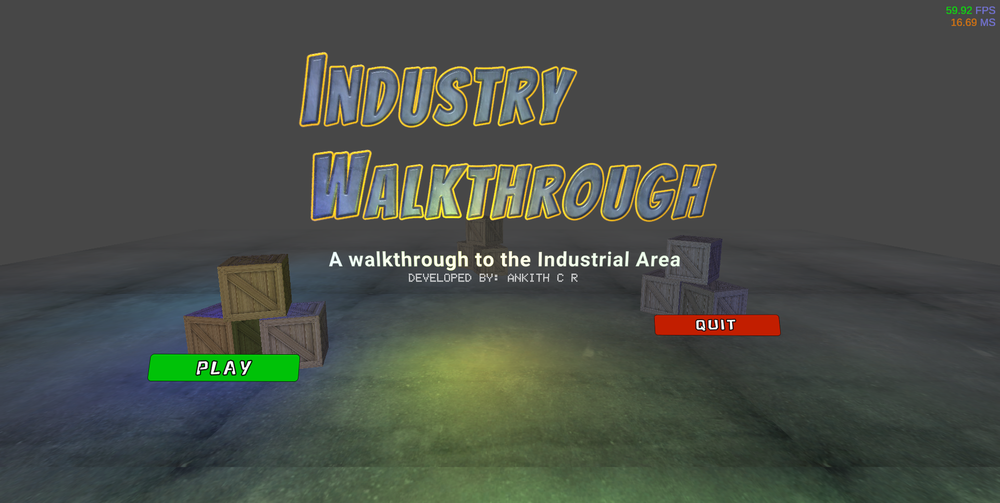
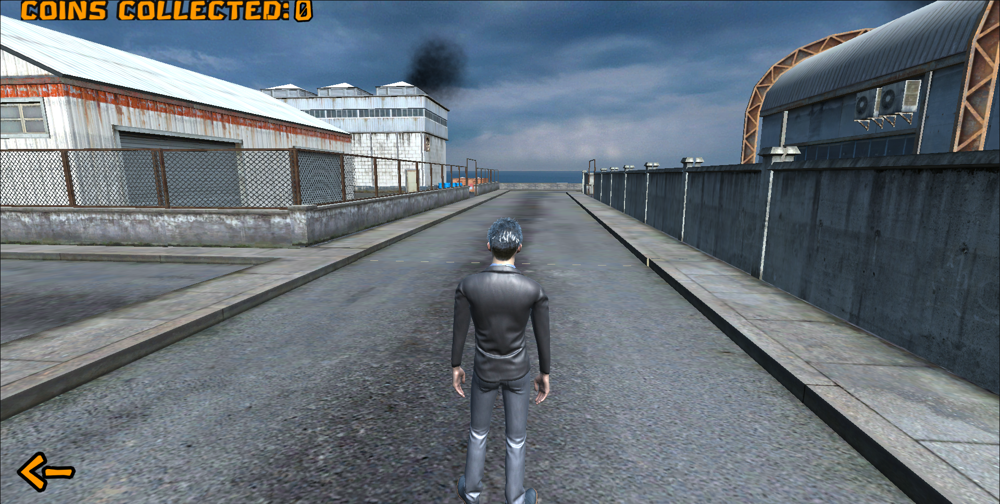

# Industry Walkthrough


An immersive 3D industrial walkthrough experience developed by ****. This project allows users to explore a detailed industrial environment directly in their web browser using Unity's WebGL technology.

In this game, players can explore the facility and search for hidden coins scattered throughout the area.

<!-- ## 🎮 Live Demo
> **Note:** To view the project, you can host these files on GitHub Pages or any static web server. -->

## 📸 Screenshots

| Landing Page | Game Scene |
| :---: | :---: |
|  |  |

## ✨ Features
- **Interactive Exploration:** Smooth navigation through the industrial facility.
- **Coin Collection:** Search for and collect hidden coins throughout the environment.
- **High-Fidelity Graphics:** Optimized 3D assets for a realistic web experience.
- **Cross-Platform:** Runs on any modern web browser (Chrome, Firefox, Edge, Safari).
- **PWA Support:** Includes a manifest and service worker for offline capabilities and installation.

## 🛠️ Tech Stack
- **Engine:** Unity
- **Platform:** WebGL
- **Languages:** C# (Unity), JavaScript, HTML5, CSS3
- **Deployment:** Optimized for web hosting

## 🚀 How to Run Locally
1. Clone this repository:
   ```bash
   git clone https://github.com/ankithcrgowda/Industry-Walkthrough.git
   ```
2. Navigate to the project directory.
3. Since this is a WebGL build, you need a local server to run it (due to CORS and WebAssembly restrictions). You can use:
   - **VS Code:** Install "Live Server" extension and click "Go Live".
   - **Python:** Run `python -m http.server` in the directory.
   - **Node.js:** Run `npx serve`.

## 📂 Project Structure
- `/Build`: Contains the compiled WebAssembly and data files.
- `/TemplateData`: UI assets for the loading screen and icons.
- `index.html`: The entry point for the WebGL player.
- `ServiceWorker.js`: Handles caching for offline support.

## 👤 Author
**Ankith C R**
- GitHub: [@ankithcrgowda](https://github.com/ankithcrgowda)

---
<p align="center">
*Developed with ❤️ using Unity.*
</p>
